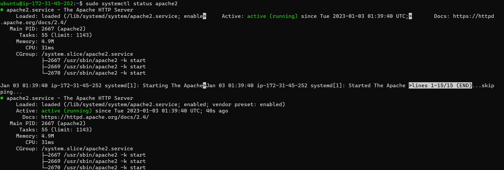
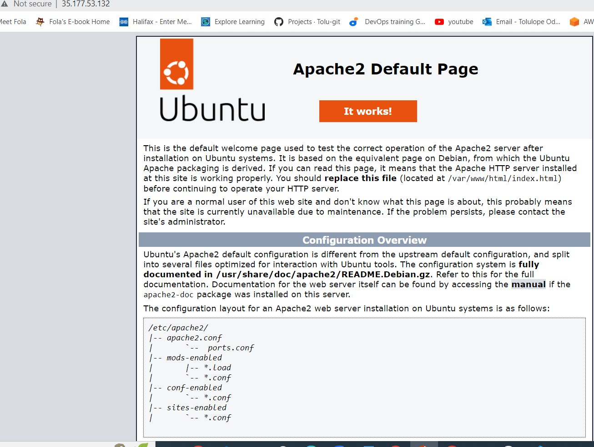

## awesome documentation of Project 1

`sudo apt update`

`sudo apt install apache`

`sudo systemctl apache2`

[Install open ssh](https://learn.microsoft.com/en-us/windows-server/administration/openssh/openssh_install_firstuse?tabs=powershell)

[Mark down](https://www.markdownguide.org/cheat-sheet/)

## http://<35.177.53.132>:80 was added to my browser

